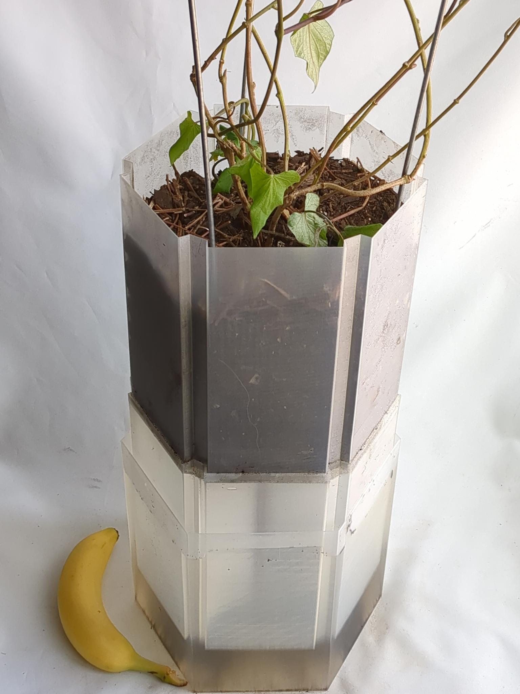

# RepRap Chinampa

Passive self-watering 3D-printable floating vegetable pot, inspired by the chinampa (floating garden bed).


*Full scale model containing satsuma imo (Japanese sweet potato) with banana for scale*

STL files can be downloaded from the [releases](https://github.com/multiplanetaryhomestead/reprap-chinampa/releases/latest) page.

## 3D Printing Notes

### 3D Printer Filament

The models have been successfully printed in Natural PLA

### 3D Printer (Hardware) Configuration/Modifications

The models have been successfully printed on a [Prusa i3 MK3S+](https://help.prusa3d.com/product/mk3s-2) using a [hardened steel 0.4mm nozzle](https://www.printedsolid.com/products/e3d-revo-obxidian-nozzles?variant=40552237400149) and [highv part cooling duct](https://www.printables.com/model/906613-highv-part-cooling-duct-for-prusa-i3-mk3s).

**NOTE**: The standard brass nozzle is **not considered food-safe**, as it wears out. A stainless-steel or titanium nozzle is recommended if you are even considering printing with food in mind.<sup>[1](#footnote1)</sup>

### Print Profile / Slicing

**IMPORTANT**: The STL models should be sliced with **vase mode** enabled in order to produce parts that are airtight and buoyant.<sup>[2](#footnote2)</sup> We recommend slicing with [OrcaSlicer](https://github.com/SoftFever/OrcaSlicer) using the following profile. Note that the profile is for a 0.8 mm nozzle, but have been successfully tested on a 0.4 mm nozzle.

    Nozzle diameter: 0.8 mm nozzle
    Layer height: 0.2 mm
    Wall generator: Classic
    Walls printing order: Inner/Outer
    Bottom shell layers: 5
    Top fill pattern: Aligned Rectilinear
    Bottom fill pattern: Aligned Rectilinear
    Internal solid infill patter: Aligned Rectilinear
    Solid infill direction: 90 degrees
    Infill speed: 5 mm/s
    Solid infill speed: 5 mm/s
    Top solid infill speed: 5 mm/s
    First layer print speed: 5 mm/s
    Max print speed: 15 mm/s
    Overhang speed:
        10%, 25%: 5 mm/s
        25%, 50%: 5 mm/s
        50%, 75%: 5 mm/s
        75%, 100%: 5 mm/s
    Extrusion multiplier: 1.2
    Nozzle temperature:
        First layer: 220 C
        Other layers: 220 C
    Bed temperature:
        First layer: 60 C
        Other layers: 60 C
    Fan speed:
        Min: 100%
        Max: 100%
    Min print speed: 5 mm/s
    Lift height: 0.5 mm
    Retraction height: 2 mm
    Ramping lift: Enabled
    Retraction speed: 50 mm/s

**NOTE**: It is recommended that your first layer is properly calibrated, as to ensure a water-tight print.<sup>[3](#footnote3)</sup>

### GCode Post-Processing

We recommend post-processing the slicer-generated gcode with the [BrickLayers](https://github.com/GeekDetour/BrickLayers) python script for increased layer adhesion along the initial layers of the print. For example:

```sh
python bricklayers.py buoy.gcode -outputFile buoy_with_bricklayers.gcode -startAtLayer 1 -enabled 1
```

## Attributions

This project was inspired by the works of

- *Chinampas* pioneered by the native Aztec tribes and farmlands of southwestern region of the Valley of Mexico
- [Self-watering rectangular planter](https://www.printables.com/model/57885-self-watering-rectangular-planter-with-optional-la)
- [Avocado Boat - minimalistic](https://www.printables.com/model/179070-avocado-boat-minimalistic-vase-mode)
- [The RepRap movement](https://reprap.org/)

---
This work is licensed under a [Creative Commons Attribution-ShareAlike 4.0 International License](https://creativecommons.org/licenses/by-sa/4.0/)

[](https://creativecommons.org/licenses/by-sa/4.0/)

<a name="footnote1">1</a>: https://help.prusa3d.com/article/food-safe-fdm-printing_112313

<a name="footnote2">2</a>: https://help.prusa3d.com/article/layers-and-perimeters_1748#spiral-vase

<a name="footnote3">3</a>: https://help.prusa3d.com/article/first-layer-calibration-i3_112364

